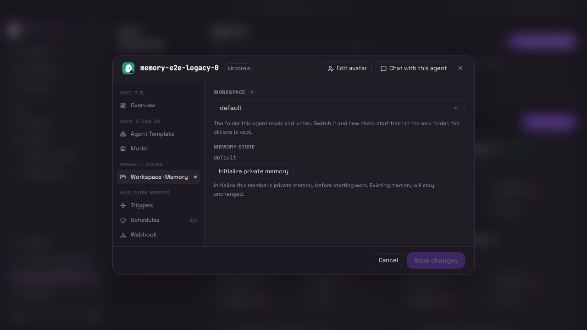
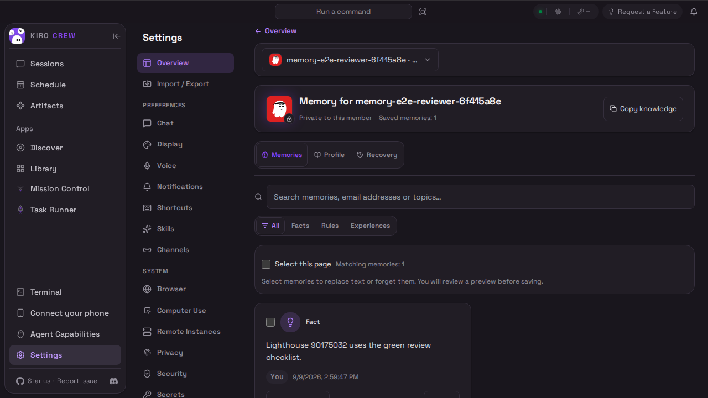
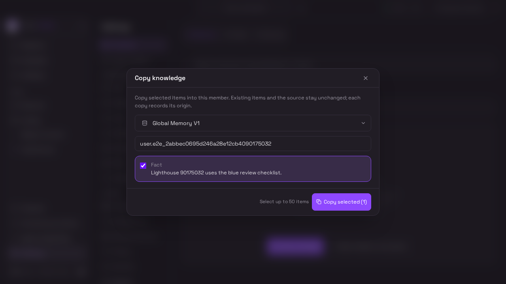
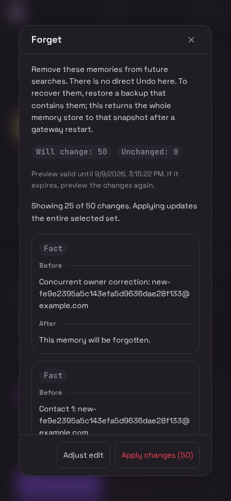
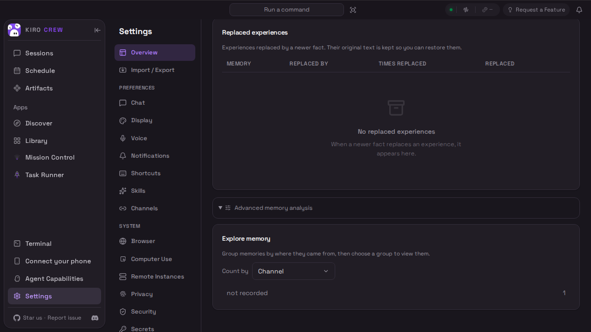
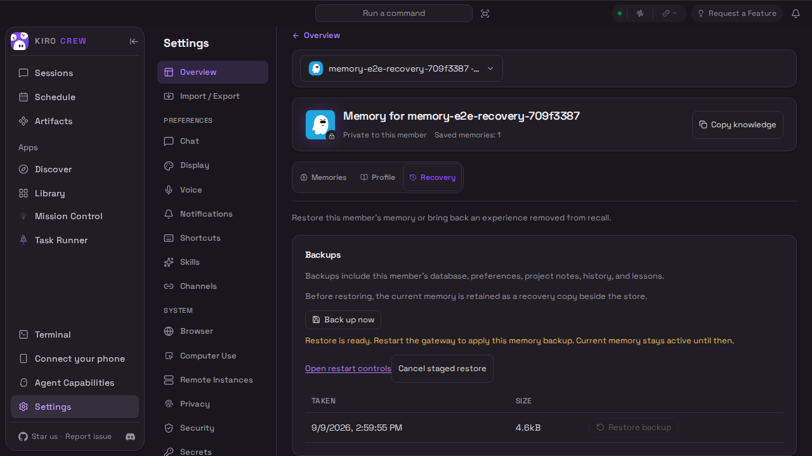

# Member memory review images

These six unedited originals come from [CI run 34365002665](https://github.com/kirodotdev/KiroCrew/actions/runs/34365002665), artifact `member-memory-ui-evidence` (10110420450). The tested merge is `b7af0bee59df49e6df51e8291bce54214de93e11`, containing feature `eb47b0f0a7ec81534652f9849f76b88c5aa73b96`. [evidence.json](evidence.json) records paths, sizes and hashes.

All eight memory scenarios passed on their first attempt, including explicit initialization, cross-store lifecycle actions, bulk corrections, proposals and staged restore cancellation. The E2E wrapper reported 18 passed; the complete inner browser count was not retained on success. All 25 original PNGs were visually inspected. These synthetic gateway scenarios do not establish live-model answers, Crew delegation or restore activation after restart. The complete CI rollup was not green, and subsequent source repairs require their own results.

All 41 originals, including eight receipts and eight recordings, remain in the [eb47 archive](https://github.com/kirodotdev/KiroCrew/tree/7d14fbf73706e3b659be5840c382960553a40425/temp-screenshots/memory-v2/ci-eb47b0f0). It includes Profile, editing, recall, proposal and initialization-refusal images beyond this selection. Recordings have not been watched end to end. Earlier evidence is preserved unchanged in the same archive. The Copy label, paged Forget preview and restart spacing in these captures predate their subsequent UI repairs.

