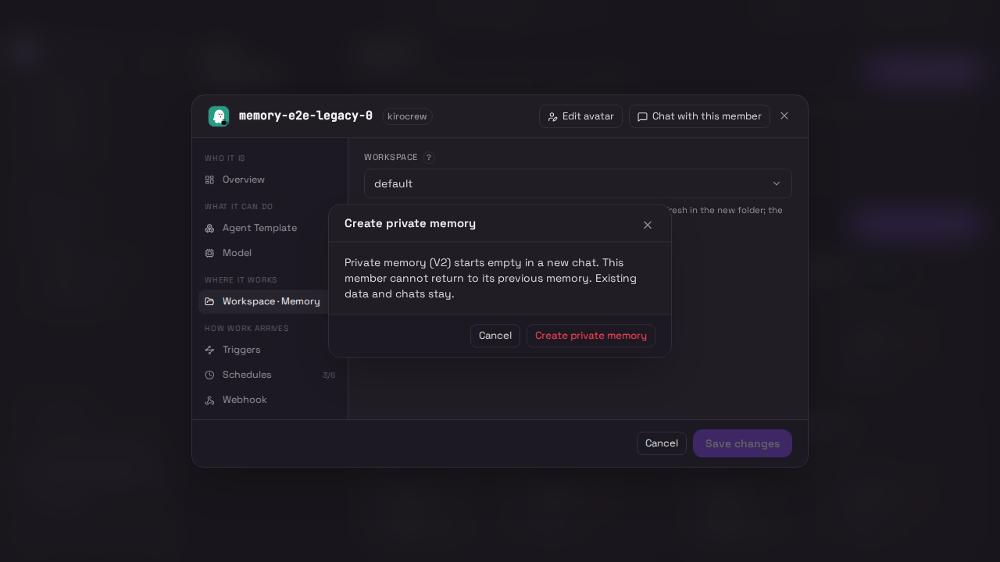
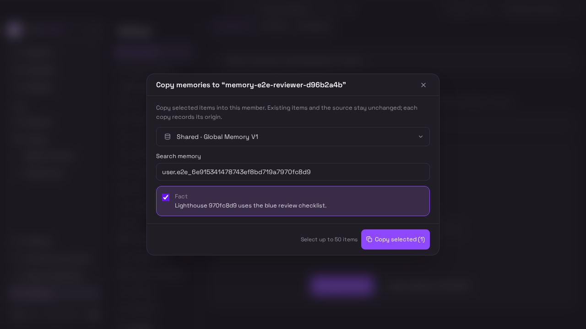
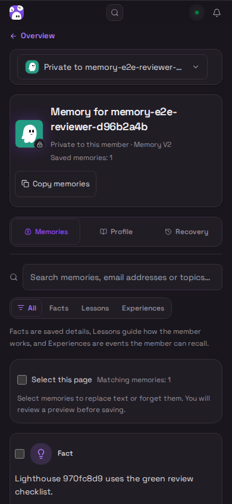
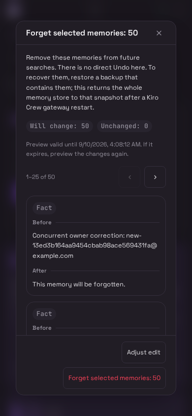
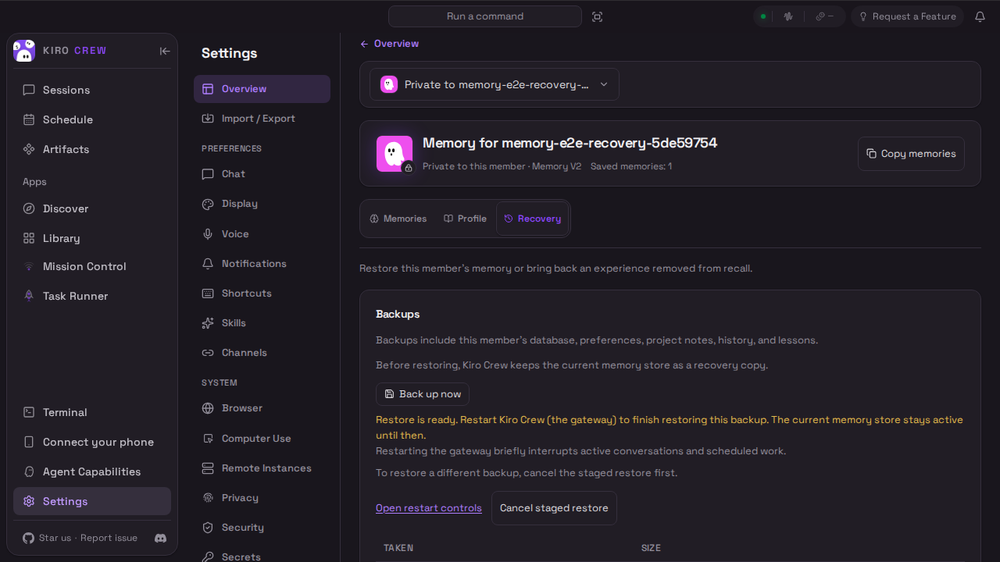
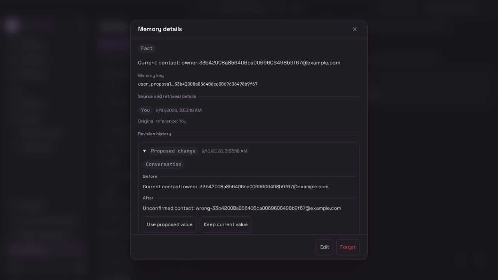

# Member memory: CI 445 captures

These 47 unedited originals are from [CI run 34433763685](https://github.com/kirodotdev/KiroCrew/actions/runs/34433763685), artifact [member-memory-ui-evidence](https://github.com/kirodotdev/KiroCrew/actions/runs/34433763685/artifacts/10135852001). They contain 29 screenshots, nine recordings and nine scenario receipts.

Capture merge `e74dbe6ec831747774c3906698ddef7a7d4c94b9` includes source `44546ae46d5dd3b2f67c6db813c3473cd9dc617a`. [evidence.json](evidence.json) records the merge parents, exact paths, sizes, hashes and outcomes. Every copied original matches the downloaded artifact.

All nine memory scenarios passed on their first attempt: legacy V1 opt-in to empty V2, exact member conversation/reload, copy/correction/Forget isolation, backup stage/cancel, dirty store switching, paged V1/V2 corrections, V1 owner protection and V2 proposal decisions. The Python E2E wrapper reported 18 passed. The complete inner browser count was not retained on success; this does not claim the whole CI matrix passed.

All 29 PNGs and 84 decoded chronological samples from all nine videos were visually inspected. No concrete layout defect was found in that inspection. Video inspection was sampled at 1 fps, not continuous playback; some brief dialogs fall between samples. The recordings include loading frames and padding when the test changes viewport size.

These synthetic dashboard/gateway scenarios do not establish live-model answers or restore activation after a gateway restart. They predate the later compact helper copy. Keep the capture source above separate from the commit used to host these files. Desktop viewport images may omit below-fold content.

Each scenario directory contains its original `member-memory-evidence.json` and `member-memory-walkthrough.webm`. The complete screenshot and recording inventory is in [evidence.json](evidence.json).

